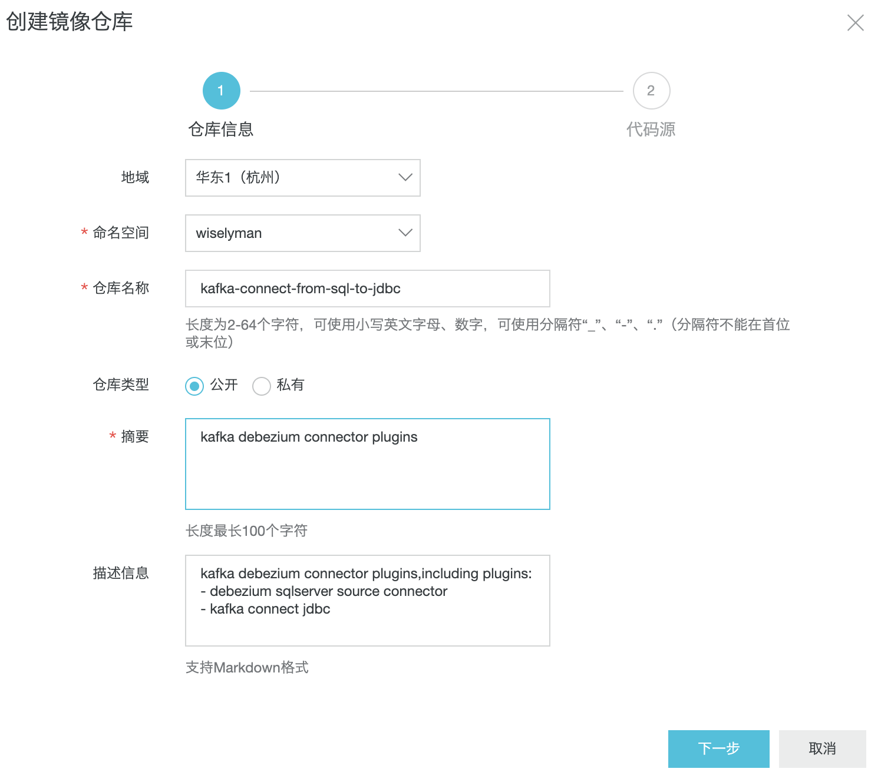
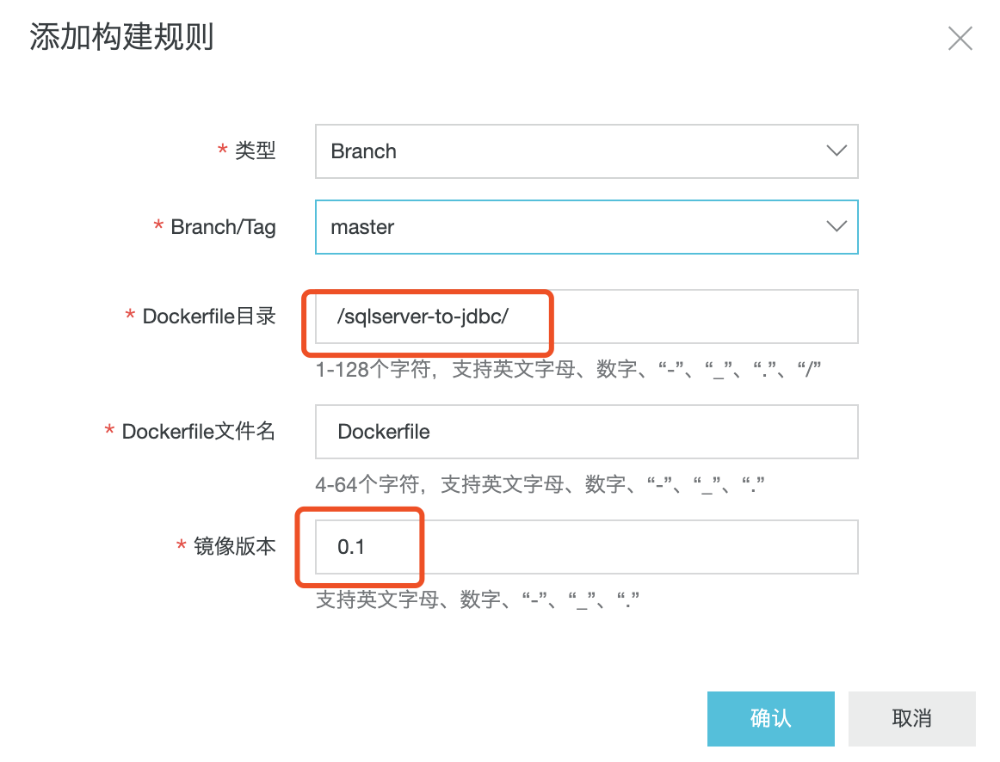

# 基于K8s的Kafka实战

## 1. Operator Framework

- Operator Framework是一个用来管理k8s原生应用（Operator）的开源工具。

- Operator Framework支持的Operator分享地址：https://operatorhub.io/。

- 如安装Kafka使用**Strimzi Apache Kafka Operator**，地址为：https://operatorhub.io/operator/strimzi-kafka-operator 。

- 打开Strimzi Apache Kafka Operator页面，右侧有**install**按钮，按照页面提示进行Operator安装。

## 2. 安装Operator Lifecycle Manager

Operator Lifecycle Manager是Operator Framework的一部分，OLM扩展了k8s提供声明式方法安装、管理、更新Operator以及他们的依赖。

点击页面上的**install**显示如何安装**Strimzi Apache Kafka Operator**，我们首先第一步要安装**Operator Lifecycle Manager**（不要执行下句命令）：

```shell
curl -sL https://github.com/operator-framework/operator-lifecycle-manager/releases/download/0.12.0/install.sh | bash -s 0.12.0
```

该命令需要使用quay.io的镜像，我们需采取从源码安装，并修改源码中的镜像地址加速。

源码下载地址：https://github.com/operator-framework/operator-lifecycle-manager/releases

当前最新版本为`0.12.0`

下载：https://github.com/operator-framework/operator-lifecycle-manager/releases/download/0.12.0/crds.yaml

下载：https://github.com/operator-framework/operator-lifecycle-manager/releases/download/0.12.0/olm.yaml

将`olm.yml`中：

```yaml
quay.io ->  quay.azk8s.cn
```

执行安装：

```shell
kubectl apply -f crds.yaml
kubectl apply -f olm.yaml
```

## 3. 安装Strimzi Apache Kafka Operator

```shell
kubectl create -f https://operatorhub.io/install/strimzi-kafka-operator.yaml
```

使用下面命令观察Operator启动情况

```shell
kubectl get csv -n operators
```

显示如下则安装成功

```
wangyunfeis-MacBook-Pro:olm wangyunfei$ kubectl get csv -n operators
NAME                               DISPLAY                         VERSION   REPLACES                           PHASE
strimzi-cluster-operator.v0.14.0   Strimzi Apache Kafka Operator   0.14.0    strimzi-cluster-operator.v0.13.0   Succeeded
```

## 4. 安装Kafka

- 下载：https://raw.githubusercontent.com/strimzi/strimzi-kafka-operator/0.14.0/examples/kafka/kafka-persistent.yaml

```shell
kubectl apply -f kafka-persistent.yml -n kafka 
```

- 发送消息测试

```shell
kubectl exec -i -n kafka my-cluster-kafka-0 -- bin/kafka-console-producer.sh --broker-list my-cluster-kafka-bootstrap:9092 --topic strimizi-my-topic
```

- 接受消息测试

```shell
kubectl exec -i -n kafka  my-cluster-kafka-0 -- bin/kafka-console-consumer.sh --bootstrap-server my-cluster-kafka-bootstrap:9092 --topic strimizi-my-topic --from-beginning
```

- 显示集群Topic

```shell
kubectl exec -n kafka my-cluster-kafka-0   -- bin/kafka-topics.sh --list --zookeeper localhost:2181
```

## 5. Kafka Connect

### 5.1 SQL Server To PosgreSQL

- 下载SQL Server Connector plugin：http://central.maven.org/maven2/io/debezium/debezium-connector-sqlserver/

- 下载PostgeSQL plugin：http://central.maven.org/maven2/io/debezium/debezium-connector-postgres/

- 新建Dockerfile文件。

- 解压两个压缩包到Dockerfile相同目录下的plugins目录：`debezium-connector-sqlserver-0.10.0.Final-plugin.zip`、`debezium-connector-postgres-0.10.0.Final-plugin.zip`

- 编写Dockerfile

  ```dockerfile
  FROM strimzi/kafka:0.14.0-kafka-2.3.0
  USER root:root
  COPY ./plugins/ /opt/kafka/plugins/
  USER 1001
  MAINTAINER 285414629@qq.com
  ```

- 使用阿里云“容器镜像服务”（[https://cr.console.aliyun.com/](https://cr.console.aliyun.com/)）编译镜像，目前我们的源码地址位于:[https://github.com/wiselyman/kafka-in-battle](https://github.com/wiselyman/kafka-in-battle)。

- “镜像仓库”->“创建镜像仓库”:

  

  

- 点击镜像仓库列表中的“kafka-connect-mysql-postgres”->“构建”->“添加规则”：

  

- 确认后，“构建规则设置”->“立即构建”，“构建日志”显示“构建状态”为“成功”即可。

  